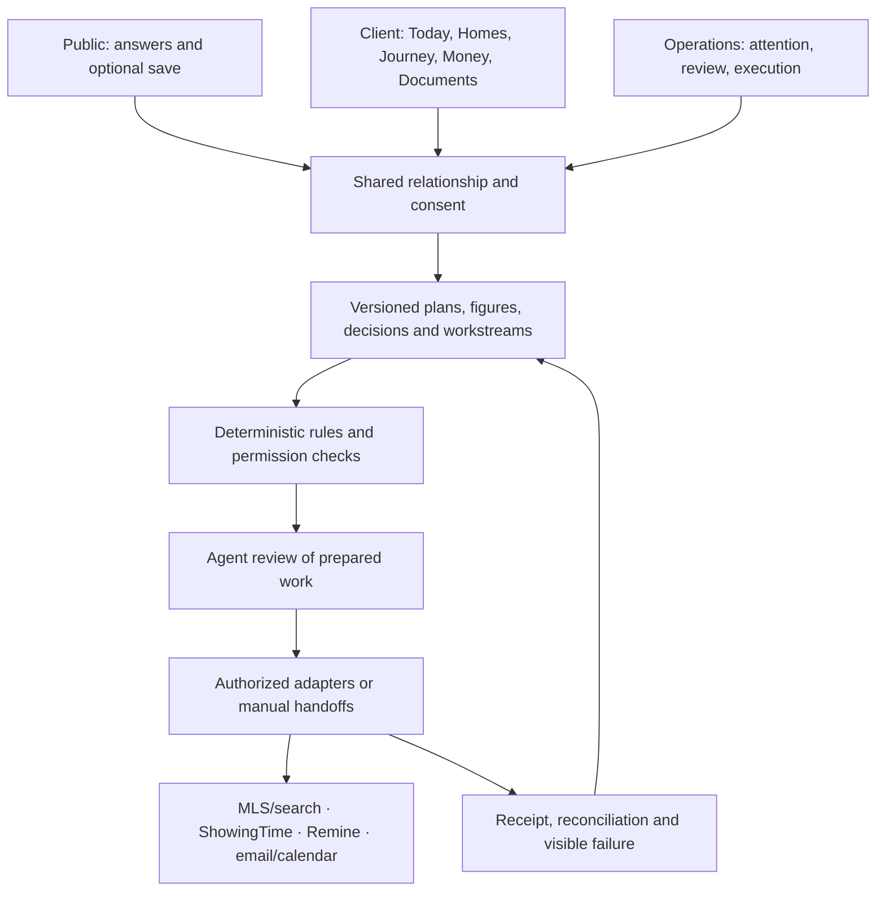

# Rift — product and experience specification v4

**Status:** proposed specification with confirmed direction recorded explicitly.  
**Release:** complete buyer journey, delivered through usable slices; buyer search is the first priority.  
**Market:** one Georgia residential agent, Kaleb. Seller workflows share the foundations and expand afterward.

## 1. Product promise and boundaries

Rift makes buying or selling understandable before, during, and after a transaction. A visitor receives a complete useful readout without an account. A client sees what matters now, what they owe, who is handling the rest, and what happens next. The agent sees the work that requires attention, with enough context to act.

The primary outcome is **more clients served clearly and consistently with less repeated coordination**. Lead conversion matters because value earns a relationship; it does not justify withholding results, covert profiling, or generating unnecessary contact.

Rift owns relationship context, plans, decisions, responsibilities, and coordination history. The MLS owns licensed listing facts; ShowingTime handles showing coordination; Remine handles GAR forms and e-signature; lenders and closing professionals provide their authoritative information. Rift records the evidence and makes it understandable. It does not become a lender, MLS, signature authority, wire-transfer tool, or contract interpreter.

### Confirmed in this review

- Build the complete buyer journey first, with shared seller foundations.
- Prioritize buyer search because it causes the most repeated work today.
- Use email sign-in for private documents and decisions; permit selected read-only summaries through share links.
- New automation prepares drafts and internal reminders; the agent approves external actions.
- Retain Matrix/OneHome for search, ShowingTime for showings, Google email/calendar, and Remine for forms/e-sign. Account-specific integration permissions are still being established.

### Non-goals for the buyer release

No freeform site builder, autonomous negotiation, automated offer acceptance, generated valuation, mortgage qualification, payment initiation, custom e-signature system, full MLS replacement, autonomous neighborhood ranking, or advanced ownership forecasting. External professionals need not adopt Rift accounts to keep a transaction moving.

## 2. The three experiences

| Surface | First question answered | Navigation | Visual character |
| --- | --- | --- | --- |
| Public | “What does my situation mean?” | Buy / Sell, tools, results, help | Expressive editorial layout, one useful signature visual, immediate numbers |
| Client | “What matters for my move today?” | Today, Homes/Property, Journey, Money, Documents; persistent Help | Calm, personal, mobile-first; concrete actions and dates |
| Operations | “What needs my judgment?” | Today, Relationships, Search, Transactions, Offers, Calendar; Campaigns and Settings secondary | Compact, stable, keyboard-friendly lists and detail panels |

“Operations” replaces “Studio” in user-facing navigation when that surface is updated. Keep `/studio` URLs working initially; renaming routes is a separate compatibility change. “Agent OS” is an architectural description, not another area users must learn.

Messages and decisions are related but distinct. A decision can link to a conversation; it must remain findable after the conversation moves on. Do not build a separate messaging platform in the first slice: retain email/call handoffs and record the meaningful outcome.

## 3. Shared vocabulary and state

| Concept | Definition |
| --- | --- |
| Person | An individual with their own identity, communication preferences, and permissions |
| Relationship | The agent's durable relationship with a person or group; existing lead identity is preserved |
| Household membership | Explicit participation, not proof that every financial detail may be shared |
| Journey | One buying or selling goal; has a side, current stage, participants, and independent status |
| Property | A home/parcel record with source-specific facts; may exist without an MLS listing |
| Listing | A time-bound listing of a property; relisting does not overwrite the former listing |
| Transaction | A specific attempted purchase/sale; retains contract, parties, versions, and outcome |
| Workstream | A concurrent body of work, such as financing or due diligence |
| Plan | Versioned, released client guidance and responsibilities |
| Snapshot | The figures and assumptions actually shown at a point in time, unchanged during retention |
| Task | One accountable person's action, with completion evidence and optional due date |
| Deadline | A sourced obligation with verification, local date/time semantics, and consequence |
| Decision | Versioned options and a recorded response; not an executed agreement |
| Approval | Authority for a specific proposed action at an exact version, recipient, and scope |

### State rules

**REQ-STATE-01:** Separate journey status (`active`, `paused`, `completed`, `cancelled`) from stage. Pausing marketing or search does not suspend contract obligations.

**REQ-STATE-02:** Buyer display stages are **Prepare → Search → Tour & evaluate → Offer → Under contract → Close → Own**. Discovery is the public entry, not a compulsory client stage. Stages summarize reality; they are not a forced sequence of screens.

**REQ-STATE-03:** Seller display stages are **Prepare → Price & launch → Market & show → Review offers → Under contract → Close → Continue**. Detailed activities are in the operating contracts.

**REQ-STATE-04:** Under-contract workstreams run concurrently: earnest money, inspection/due diligence, financing, appraisal, title, insurance, repairs, closing/possession. Each has its own state, owner, evidence, and deadlines. Cash buyers mark inapplicable financing work explicitly; they do not receive fictional lender milestones.

**REQ-STATE-05:** Stage changes require evidence and an authorized actor. Elapsed time, an AI suggestion, or checking unrelated tasks cannot advance a transaction. Preserve source event, previous/new stage, reason, actor, timestamp, and expected record version.

**REQ-STATE-06:** A failed offer returns the journey to search or offer preparation while preserving that offer attempt. A terminated contract closes that transaction attempt and retains its obligations/history; restarting creates a new attempt. Deadline amendments supersede specific dates and cancel superseded reminders atomically.

**REQ-STATE-07:** A sale and purchase may be linked by dependencies such as proceeds or possession. One journey must never be silently advanced by the other's stage. R1 displays a manually confirmed dependency and owner; automated sequencing comes later.

## 4. Public value and continuity

**REQ-LEAD-01:** Every entry tool answers its advertised question before asking for contact details. The full result, assumptions, and limitations remain available if the visitor declines to save, book, or subscribe. A campaign may not hide its promised readout behind a “download gate.”

**REQ-LEAD-02:** Ask only inputs needed for the selected tool. Explain sensitive inputs, distinguish unknown from zero, and distinguish user answers from planning defaults. Show a useful partial result as soon as valid inputs permit one. Preserve back navigation and edits without duplicating telemetry.

**REQ-LEAD-03:** Offer “Save my plan,” “Ask Kaleb to review,” and “Book a conversation” after value. Saving, representation, marketing permission, and transaction readiness are separate events. Saving does not imply hiring the agent or joining marketing nurture.

**REQ-LEAD-04:** Carry valid answers, explicit preferences, source, and snapshots into the client journey with their original dates. Ask clients to confirm only stale, missing, conflicting, or consequential information. Do not ask everyone to repeat their assessment.

**REQ-LEAD-05:** Preserve immutable first touch. Store agent corrections separately and update last touch separately. Campaign parameters must be controlled identifiers, bounded and sanitized; never financial answers, access tokens, full referring URLs, or free-text personal information.

**REQ-LEAD-06:** Anonymous same-device progress has an expiry and a clear delete/reset action. Cross-device restoration requires an authorized claim. Do not identify anonymous visitors by fingerprinting or merge them using an unverified email match.

**REQ-LEAD-07:** Existing saved readouts continue rendering their original figures. A recalculation creates a new snapshot with engine/rule/input versions and a comparison; old links never silently acquire new numbers.

## 5. Buyer search — the first usable slice

This is the initial product improvement, not an optional integration enhancement. Its success is fewer repeated preference conversations and less manual search maintenance while the buyer retains control of tradeoffs.

Kaleb identified the precise repeated work: translating preferences and setting up or updating searches in Matrix/OneHome. Ship the reviewed criteria/setup-update workflow before spending effort on a full inventory browser or extensive tour optimization.

### 5.1 Search brief

Entry: the agent opens an existing buyer relationship or a visitor asks for help after receiving value. The client confirms an existing draft instead of starting from a blank form.

The brief captures price target, explicit maximum, monthly comfort target, cash constraints, selected geography, property type, bedrooms, bathrooms, must-haves, preferences, deal breakers, timing, and source. Financial fields are private according to membership grants. Budget eligibility comes from a lender, not the brief.

Each criterion carries: value/unit, `hard | preference | undecided`, who stated it, when, why if volunteered, and whether the external search system can express it. “Basement preferred” must not become “basement required.” A conflict between household members is visible; Rift does not average or silently resolve it.

**REQ-SEARCH-01:** The agent can review the exact brief and edit individual criteria. Client corrections create a new revision. Unsupported provider filters are marked for manual evaluation and excluded from any false claim that the provider is enforcing them.

**REQ-SEARCH-02:** An approved search package contains the destination system, copyable criteria, notification cadence, exclusions, version, approver, and activation status. If write integration is absent, the CTA is “Open search setup” / “Copy criteria,” followed by “Record activation.” It never says “Search activated” without a receipt or agent confirmation.

**REQ-SEARCH-03:** An external saved search has an external ID/link, last approved configuration, last observed configuration where available, and status: `draft`, `awaiting-approval`, `manual-action-needed`, `active-confirmed`, `update-pending`, `paused`, `error`, or `unknown`. Unreadable external state is unknown, not active. Never overwrite external edits silently.

### 5.2 Shortlist and home review

Start with buyer/agent-added property links and licensed facts where available. Link-only records remain useful when inventory access is absent. Do not scrape listing pages or copy protected media as an undocumented fallback.

Each card presents price/source/as-of time, fit reasons against the approved brief, unresolved facts, reaction, next step, and an external source link. Replace “91% match” with “Meets your three required filters; basement unconfirmed.” Do not imply payment fit when taxes, insurance, HOA, or rate assumptions are missing.

**REQ-SEARCH-04:** Reactions are `interested`, `maybe`, `pass`, and `tour-requested`. Reasons are optional. Reactions are individual, visible according to shared-shortlist permissions, reversible with history, and separate from property facts. A co-buyer disagreement stays visible.

**REQ-SEARCH-05:** A property comparison shows like-for-like fields, unknowns, monthly scenarios, cash impact, and client priorities. Agent-only remarks, access codes, and third-party private data never appear in client projections.

**REQ-SEARCH-06:** Preference changes are proposed, not inferred into active filters. A suggestion shows the explicit feedback supporting it. Clicking “Use this preference” revises the brief; updating the external search still requires agent approval. No passive browsing dossier is necessary for this workflow.

### 5.3 Tours and feedback

**REQ-SEARCH-07:** A tour request creates a request, not a confirmed appointment. ShowingTime remains the operational destination. The itinerary distinguishes requested, awaiting confirmation, confirmed, changed, cancelled, and completed stops. Revalidate changed times, representation coverage, and property status before confirmation.

**REQ-SEARCH-08:** After a tour, collect a brief reaction and optional property-specific reasons. The next useful question is “Would you consider an offer?” or “What should change in the search?” Do not demand lengthy ratings for every room.

**REQ-SEARCH-09:** If no homes fit, show which hard requirements limit the search and let the buyer discuss a change. Do not silently raise budget, broaden geography, downgrade requirements, or manufacture inventory. Withdrawn listings remain in the history and leave the active shortlist.

### 5.4 Pilot success criteria

Proposed test targets: prepare a reviewed search package from an existing brief in five minutes; locate the latest client priorities without asking again; record feedback in under one minute; make an approved search update without re-entering unchanged information. Measure against the agent's current process before declaring improvement. These are research targets, not guaranteed service levels.

## 6. Client Today and journey UX

Today answers: current stage, next action, meaningful dates, what the agent/others are doing, what changed, and how to get help. Show the most important action first, followed by other urgent obligations; “one primary action” must never hide a second real deadline.

### Deterministic next-action policy

1. Show verified urgent obligations and unresolved critical blockers, ordered by due time and consequence.
2. Show released decisions requiring this person's response.
3. Show this person's next actionable task whose dependencies are satisfied.
4. If the work belongs to someone else, show the named owner, last update, expected check-in, and escalation path.
5. If nothing is currently owed, say so without implying that every third party is on track.

Agent pinning is allowed with a reason and expiry, but cannot suppress critical obligations. Client-facing priority cannot depend on commission potential or lead score. All household participants see actions addressed to the correct person.

**REQ-UX-01:** Empty, loading, partial, waiting, blocked, overdue, failed, offline, revoked-access, and completed states have explicit copy and a useful next step. An empty query caused by an outage is not “nothing to do.”

**REQ-UX-02:** A task marked done by a client records a claim of completion. It does not verify receipt of funds, lender approval, signed documents, or completion by another professional.

**REQ-UX-03:** Journey views distinguish achieved milestones from future possibilities. Do not display a transaction success percentage. Counts may say “4 of 6 required items confirmed; title still pending,” without suggesting equal risk.

**REQ-UX-04:** “Rift is watching” requires an enabled monitor, scope, last successful check, and a failure state. “Your agent recommends” requires approved text and author/version. “Lender confirmed” requires the named lender and dated evidence.

## 7. Money and evidence

### 7.1 Financial contract

Customer financial calculations stay in `lib/core/compute.ts` and verified registries, with shared pure helpers where appropriate. Imported official figures must be rendered as sourced records, not invented calculations. Displayed activity counts and dates come from records and deterministic rules. Language models may extract candidate values for review but never author numerical claims or silently choose assumptions.

**REQ-MONEY-01:** Every financial output carries amount, currency, unit, assumptions, source/as-of date, engine version where computed, failure explanation, and review state. Unknown is not zero. Estimates and official figures cannot share an indistinguishable label.

**REQ-MONEY-02:** The public buyer headline retains `assistance: 0`. Possible programs appear as conditional upside. Program presence is not approval. If a program is stale, suppress matching and explain the withheld result. Never add overlapping assistance amounts without validated combination rules.

**REQ-MONEY-03:** R1 introduces a versioned breakdown:

| Label | Meaning |
| --- | --- |
| Estimated total buying budget | Down payment and applicable transaction costs plus separately identified non-settlement costs, counted once |
| Needed before closing | Deposits and expenses due earlier, with actual due dates when known |
| Estimated remaining funds at settlement | Settlement obligations less confirmed deposits/paid credits and applicable approved credits; not moving expenses |
| Suggested reserve / cash remaining | Separately stated planning assumption and user-selected buffer, never disguised as a lender requirement |
| Official cash to close | The verified figure from the applicable current closing document, with issuer and version |

The ledger classifies each item by category, payer, timing, estimated/quoted/paid state, settlement-credit treatment, and source. Earnest money counts toward liquidity timing but is not a second cost. A paid inspection or appraisal is not paid twice. Negative settlement/net amounts retain their meaning instead of being blindly floored to zero. The existing buyer savings-gap floor remains a separate rule.

Do not relabel historical saved figures. New snapshots record the new contract version; the UI explains the terminology change. Reconcile to the official document line by line; a mismatch creates a question for the lender/closing professional rather than an automatic correction to the document.

**REQ-MONEY-04:** Payment planning covers principal/interest, applicable mortgage insurance, taxes, insurance, HOA, and optional maintenance/reserve estimates clearly separated. Property-specific missing costs are visible. Loan-program-specific treatment needs an explicit tested model; the generic PMI rule must not be described as complete FHA/VA/USDA underwriting.

**REQ-MONEY-05:** A comfort range is a planning scenario constrained by explicit inputs, never a lending determination. Initial release compares costs at client-chosen prices; an inverse solver requires its own inputs, bounds, monotonicity/edge-case tests, and assumption disclosures before release.

**REQ-MONEY-06:** Seller net is sale price minus uniquely classified costs and payoff. Compensation is negotiated, never presented as a standard rate. Seller credits and buyer-broker compensation must not be double-counted. Negative net is an amount to resolve, with an appropriate lender/agent next step, not “you keep -$…”. No generated repair ROI, valuation, appreciation, or equity figure.

**REQ-MONEY-07:** Preserve the existing material drift guard at 3% pending an approved revision. Also propose mandatory disclosure for sign changes, newly missing inputs, or changed authority even when a percentage threshold does not express the issue. Publication never promotes verification.

### 7.2 Evidence contract

Record these dimensions independently:

- **Origin:** user-reported, agent-entered, computed, provider-reported, document-extracted.
- **Review:** preliminary, pending-review, reviewed, verified; obey existing ceilings and named-party verification.
- **Freshness:** current within its policy, stale, superseded, unknown.
- **Authority:** who can confirm this fact, distinct from who entered it.
- **Provenance:** source ID/version/page, observed date, reviewer/date, and relevant assumptions.

“Calculated” describes origin, not certainty. An old lender confirmation can be verified but stale. When inputs change, create a new figure and review state rather than inheriting verification from the prior result.

## 8. Documents, decisions, deadlines, and funds

**REQ-DOC-01:** Preserve the original document and checksum. Classify it by transaction, family, form/edition where known, parties, and version. Separate private originals from client-approved summaries. Files enter quarantine before becoming available; type/size/content validation, scanning, and access controls precede processing.

**REQ-DOC-02:** Extraction returns candidate fields with exact source references and unresolved alternatives. Consequential amounts, dates, parties, and terms require human confirmation regardless of model confidence. A processing failure leaves a usable original and manual entry path.

**REQ-DEC-01:** A decision includes options, comparable financial quantities, tradeoffs, source documents, response deadline, decision makers, and agent context. A release records the exact revision. A later counteroffer supersedes the old decision and invalidates approvals and pending actions tied to it.

**REQ-DEC-02:** Client response requires authenticated identity, permission, and the current decision version. Store the exact option set seen. Household disagreement is an unresolved state; “first click wins” is not a rule. All required decision makers or documented authority must be satisfied before agent execution.

**REQ-DEC-03:** R1 client responses are instructions/preferences for agent follow-up. They do not constitute e-signatures, acceptance, legal notices, or external delivery. Remine governs signed documents. The transaction becomes binding only after the agent records appropriate evidence and confirmed terms.

**REQ-DATE-01:** Store the source term, source version/page, trigger event, local date and time if specified, IANA timezone, calendar/counting rule, verified-by/time, and computed instant where applicable. Date-only and unknown-time values are distinct. Do not silently assign 5 PM or midnight.

**REQ-DATE-02:** Unverified dates create an internal verification task; they do not become reassuring client countdowns. A contractual due date and the agent's earlier preparation target are distinct. Business-day, holiday, amendment, time-zone, and daylight-saving tests are required. No universal Georgia deadline formula is inferred from a form number.

**REQ-DATE-03:** A missed deadline creates an urgent agent item; software does not declare rights waived, contracts terminated, or extensions effective. Acknowledging an alert does not resolve the obligation.

**REQ-FUNDS-01:** Rift tracks amount, holder, due date, submitted evidence, and confirmed receipt separately. No bank account numbers or routing instructions generated, extracted into casual copy, or changed through chat. Initial release directs users to verified closing-professional channels and independent contact verification; Rift does not initiate payment. Any future instruction display needs a separately reviewed security workflow.

## 9. Operations and automation

Operations groups work into Needs attention, Today, Waiting, and Upcoming. Each item includes why it exists, who owns it, related client/property/transaction, evidence, due time, next action, and a clear resolution. Filters persist; returning from a detail page preserves queue position.

**REQ-OPS-01:** Internal notes, lead scores, private contact basis, private lender files, and competing-party information never leak into a client projection. Client updates are deliberately authored/released objects.

**REQ-OPS-02:** Snoozing requires an accountable owner and a resume time; it cannot change a contractual deadline. Delegation requires acceptance or a visible unaccepted state. External parties can be tracked without accounts, with agent-recorded evidence.

**REQ-AUTO-01:** Confirmed initial mode: create drafts and internal reminders automatically; all new external actions require agent approval. Approval binds payload/version, destination, recipient, attachments, channel, and relevant record versions. A material change invalidates approval.

**REQ-AUTO-02:** Every run records `prepared`, `awaiting-approval`, `queued`, `running`, `succeeded`, `failed`, `unknown-outcome`, or `cancelled`, with idempotency key, attempts, receipt, and recovery owner. Timeouts after a send are unknown outcomes; reconcile before retrying. Do not claim “exactly once” across a provider that cannot support it.

**REQ-AUTO-03:** Recheck consent, representation where applicable, version, and revocation immediately before execution. A human reply stops nurture before the next send. Channel changes require valid permission and a useful fallback; a text-to-email fallback must not override email opt-out.

**REQ-AUTO-04:** Existing consented nurture remains under its existing policy until explicitly reconciled. The confirmed draft-first policy governs new search, tour, transaction, campaign, and client-update actions; it is not implicit permission to change all existing sending behavior.

**REQ-AUTO-05:** AI handles structured intake drafts, document candidates, concise source-linked summaries, and proposed campaign recipes. It does not publish, send, modify active searches, decide representation, move money, set legal deadlines, or change numerical claims autonomously. Uploaded documents and messages are untrusted content; embedded instructions cannot grant tool permissions.

**REQ-AUTO-06:** Set per-workflow and monthly cost/usage limits before enabling AI. Exhaustion produces manual entry, not a lost deadline or blocked core workflow. Model/prompt versions and reviewed corrections are auditable; private data is not repurposed for model training by default.

## 10. Access, data use, and privacy

**REQ-ACCESS-01:** Email sign-in identifies a person; it does not grant membership. Invitations bind verified identity to an explicit journey role. Revoke access independently of deleting historical evidence. Do not authorize by user-editable profile metadata.

| Actor | Default scope | Excluded by default |
| --- | --- | --- |
| Anonymous visitor | Their in-progress local inputs, public tools, intentionally shared summary | Client files, agent records, transaction actions |
| Client member | Authorized journey, released plan, own tasks/decisions and granted documents | Agent notes/scores and other people's private finances |
| Co-buyer/co-owner | Explicit shared journey resources | Automatically seeing every member's income, credit, or bank documents |
| Agent | Their tenant's authorized relationship/transaction records | Other tenants |
| External professional | R1 manual handoff; later narrowly granted task/document scope | Whole household file, other offers, unrelated finances |
| Read-only share recipient | Explicit selected summary revision until revoked/expired | Identity claims, decisions, write actions, private originals |

**REQ-ACCESS-02:** Share links use high-entropy tokens stored as hashes in new designs, explicit scopes, revocation, expiry policy, no-referrer/noindex, and non-shared caching. Old token links retain their old limited projection. Link previews, analytics, logs, and error reports must not expose tokens or financial inputs.

**REQ-PRIV-01:** Separate product data, first-party aggregate analytics, and operational audit. Calculator answers, saved/rejected homes, reasons, and documents belong to private product records when deliberately saved. Analytics cannot receive financial values or free-form browsing history through a newly named event field.

**REQ-PRIV-02:** Retain existing published retention commitments until a reviewed migration updates policy, UI, jobs, and tests together. Immutability does not defeat authorized deletion. Broker-required records need a specific basis and expiry; eligible personal data is deleted, not silently soft-deleted. Do not promise indefinite ownership storage until its retention contract is approved.

**REQ-PRIV-03:** Do not import entire lender financial files merely to record preapproval status. Store the minimum needed to coordinate; keep highly sensitive financial documents in their professional systems where practical.

**REQ-PRIV-04:** Sharing with an agent, marketing subscription, booking contact, recording consent, and representation are separate permissions. Opt-out and access revocation must reach queued jobs and provider syncs. A household member cannot consent to marketing for another member.

## 11. Campaigns and public design

Keep the expressive public direction: warm canvas, editorial display type, restrained accents, useful financial artifacts, and clear input-to-result feedback. Reuse the established brand tokens after contrast checks. Client and operator surfaces share the system but use different density.

**REQ-CAMP-01:** Campaigns are immutable published recipes of approved block types/versions and schema-validated properties. No arbitrary HTML, scripts, remote embeds, custom CSS, or client-supplied calculation formulas. AI may draft a recipe, never executable code.

**REQ-CAMP-02:** Start with one buyer recipe using the existing assistance/readout path, transparent explanations, an approved visual, and optional capture. A general composer follows the buyer release. Advanced maps, inventory blocks, personalization, experiments, and custom domains remain later.

**REQ-CAMP-03:** Preview at mobile/desktop, validate required disclaimers and sources, check supported block versions, then publish atomically. Store author, revision, publish/unpublish state, route slug, and campaign attribution. Rollback points to a prior valid version; old visitor sessions remain pinned to the versions they used.

**REQ-CAMP-04:** Tools share computation and input contracts across public pages, portal, and Operations. Presentation variants may change layout, not financial logic, permissions, or eligibility conditions. An artifact reads the same computed output as the table and has an equivalent text representation.

**REQ-CAMP-05:** No fabricated testimonials, inventory counts, activity, client stories, or property data. No promised output is gated behind a contact form. Review requests use neutral eligibility and are separate from private service recovery, subject to resolving F15.

## 12. Quality and release evidence

**REQ-QUALITY-01:** Target WCAG 2.2 AA. Verify keyboard flow, visible focus, labeled errors, screen-reader announcements, contrast, reduced motion, 200% zoom, and 44px client touch targets. Financial charts have text/table equivalents; state always has words and an icon. [WCAG 2.2](https://www.w3.org/TR/WCAG22/)

**REQ-QUALITY-02:** Verify client flows at 375px and 390px, plus desktop; no clipped figures or hidden actions. Critical instructions work without motion or decorative assets. Show explicit retry and unsaved-state feedback on flaky connections. Offline state cannot accept authoritative decisions.

**REQ-QUALITY-03:** Proposed public performance targets are LCP ≤2.5s, INP ≤200ms, CLS ≤0.1 at the 75th percentile, measured on real traffic when available. Lab results are provisional. Load optional visuals after the useful tool and prevent layout shifts. [Web Vitals](https://web.dev/articles/vitals)

**REQ-QUALITY-04:** Integration health distinguishes configured, authorized, last-successful, stale, unavailable, and failed. Presence of credentials is not proof of delivery. Monitor missed scheduled runs, queue lag, unresolved unknown outcomes, access failures, and orphaned tasks without logging private payloads.

### Metrics with denominators

| Outcome | Measurement | Guardrail |
| --- | --- | --- |
| Public value | Completed readouts / valid started assessments, by campaign/version | Completion does not require capture |
| Conversion | Captured relationships and confirmed consultations / completed readouts, separately | Requested booking is not confirmed booking |
| Search efficiency | Agent minutes per initial setup and approved update; repeated data-entry count | Baseline before claiming savings |
| Buyer search clarity | Buyers who can state priorities and next step unaided / observed pilot participants | Record confusion and household disagreements |
| Coordination | Status-chasing questions per active buyer-week; overdue unowned/unsourced work | Do not suppress questions to improve a metric |
| Reliability | Verified executions / attempted approved executions; unresolved failures by age | Timeouts remain unknown until reconciled |
| Transaction safety | Incorrect released deadlines, duplicate sends, unauthorized exposure, stale approvals executed | Any such incident requires investigation before expansion |
| Capacity | Active clients served with stable response and missed-obligation rates | More clients alone is not success |

Do not invent a conversion target from the draft. Use existing benchmark goals as hypotheses and report actual denominators, missing data, and small samples. Release gates and test scenarios are in the implementation plan.
